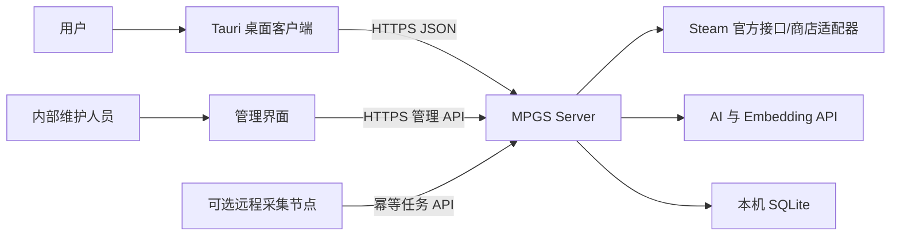
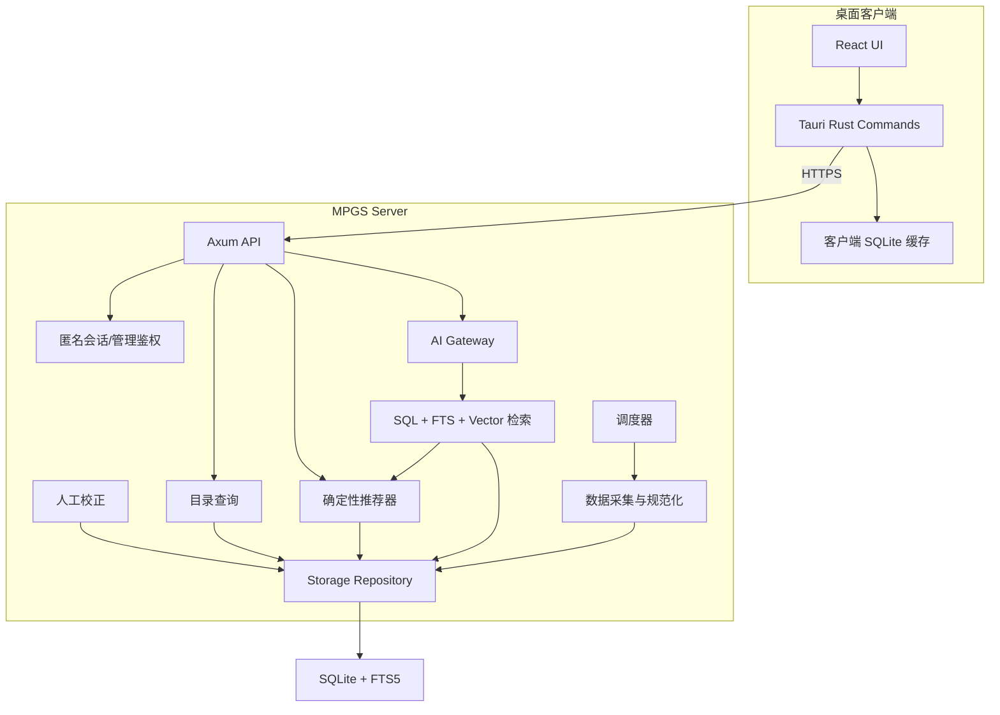
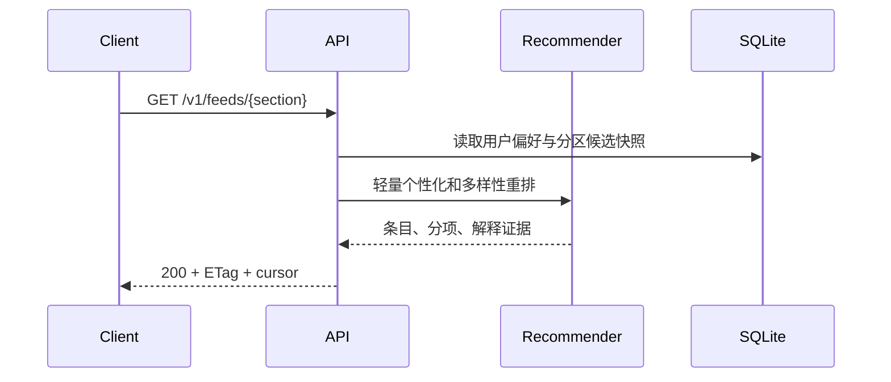
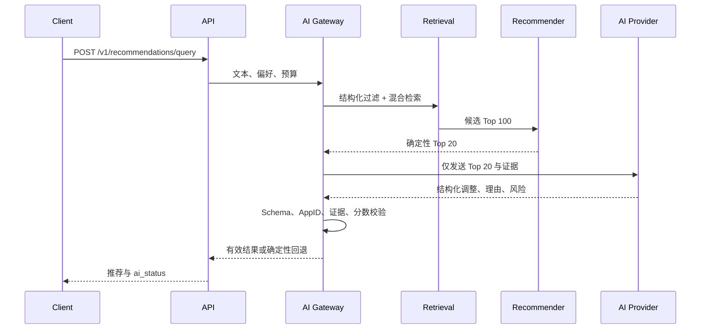
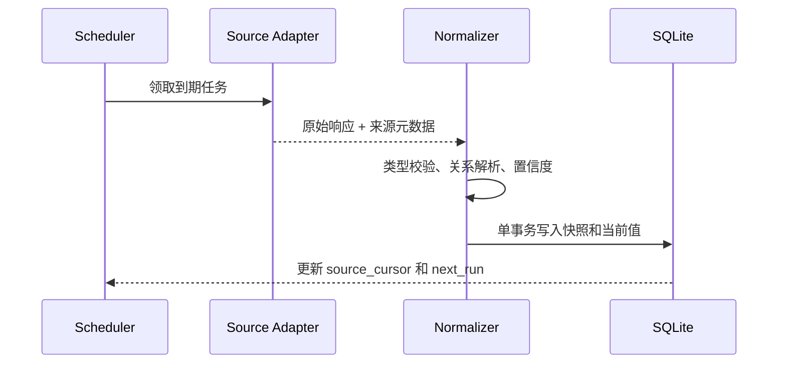

# 系统架构

## 1. 架构目标

MPGS 采用 C/S 架构。桌面客户端只负责交互、轻量偏好和离线缓存；服务端负责 Steam 数据采集、权威存储、推荐、AI 调用和策略控制。

MVP 的首要目标是边界清晰、可回退和跨平台，而不是主动引入多主数据库或微服务复杂度。

## 2. 约束

- 服务端必须可构建为 Windows/Linux 的 `x86_64` 与 `aarch64` 产物。
- 客户端目标为 Windows/Linux/macOS；Android 是后续目标。
- 权威数据库使用 SQLite，数据库文件与访问它的服务进程同机。
- Steam Web API Key、AI API Key 和内部管理凭据不能进入客户端。
- 推荐必须在 AI 不可用时保持完整的基础功能。
- 所有外部数据都带来源、抓取时间和可信度。

## 3. 系统上下文



客户端永远不连接权威 SQLite。远程采集器和 AI Worker 也不直接打开数据库文件。

## 4. 逻辑组件



### 4.1 桌面客户端

职责：

- 首次偏好引导、推荐流、日历、搜索、详情和 AI 对话界面。
- 保存离线推荐快照、静态详情、偏好副本和待同步反馈。
- 通过 ETag/游标做增量同步。
- 调用系统浏览器或 Steam 协议链接，不持有 Steam/AI 服务端 Key。

Tauri Rust 层只暴露明确命令，不提供任意文件读取或任意 HTTP 代理。Tauri capabilities 按最小权限配置。

### 4.2 API 服务

职责：

- 对外提供版本化 REST JSON API 和 OpenAPI 文档。
- 校验输入、限流、建立请求 ID，并执行授权。
- 组合目录、推荐、AI 和反馈服务。
- 对可缓存资源生成 `ETag`，对写请求支持幂等键。

MVP 不引入独立 API Gateway 产品，Axum 服务本身承担入口职责。

### 4.3 数据采集与规范化

职责：

- 调用 Steam 官方接口和经批准的商店适配器。
- 按 AppID、来源与时间保存原始字段哈希和规范化结果。
- 维护游戏、Demo、Playtest、专用服务器工具和版本之间的关系。
- 计算评论、CCU、价格和发售日期快照。
- 对限流、暂时失败和永久失败使用不同重试策略。

采集器不得直接把外部响应覆盖人工校正。最终有效值按“人工确认 > 可靠官方字段 > 多源一致推断 > 单源 AI 推断”决议。

### 4.4 推荐器

推荐器分为四个阶段：

1. 硬条件过滤：类型、发售状态、平台、人数、服务状态等。
2. 分区候选生成：最近发售、即将发售/Demo、人气老游、经典老游。
3. 确定性评分与个性化重排。
4. 多样性重排；在自然语言场景中允许 AI 对 Top N 做受限调整。

推荐器是纯 Rust 领域组件，不依赖 Axum、SQLite 或具体 AI SDK，便于离线测试和多平台复用。

### 4.5 AI Gateway

职责：

- 对不同 AI 供应商提供统一 `AiProvider` 与 `EmbeddingProvider` 接口。
- 暴露白名单检索工具，禁止模型执行任意 SQL。
- 验证结构化输出、候选 AppID、分数范围和证据引用。
- 缓存可复用分析，记录模型与提示词版本。
- 超时、限额、供应商故障或验证失败时回退到确定性结果。

详细约束见 [AI 检索与安全](AI.md)。

### 4.6 人工校正

内部管理界面是 MVP 必要组件，因为 Steam 元数据不能完整表达自建服、私人房和公共匹配依赖。

校正必须包含操作者、原因、旧值、新值、证据链接和生效时间。删除校正时应恢复到当前最佳来源值，而不是恢复历史旧值。

## 5. Rust workspace 边界

目标目录：

```text
apps/
  server/                 Axum 进程与组合根
  desktop/                Tauri 2 应用，MVP 客户端里程碑建立
crates/
  domain/                 AppID、分区、特征、API 无关领域类型
  recommender/            候选评分、个性化、解释和黄金测试
  storage/                Repository trait、SQLite 实现、迁移
  steam-source/           Steam 接口、限流和规范化
  retrieval/              SQL/FTS/向量混合检索
  ai/                     Provider、工具、结构化验证和缓存
  api-contract/           OpenAPI DTO 与错误模型
migrations/               SQLite 迁移
web/                      React/TypeScript UI
docs/                     规格与决策
```

当前已建立 `domain`、`recommender`、`steam-source`、`storage`、`server` 与 `dbtool`。M4 起新增桌面客户端：前端在 `web/`（Vite + React + TypeScript，pnpm workspace），Tauri 2 壳在 `apps/desktop/src-tauri/`。`retrieval`、`ai`、`api-contract` 按 [MVP 开发计划](MVP_PLAN.md) 在后续里程碑增量加入，避免先生成大量无实现空包。

`apps/desktop/src-tauri` 是一个独立的 Cargo workspace（其 `Cargo.toml` 带空 `[workspace]`），不进入根 Rust workspace，使根 `cargo test --workspace` 与 CI 不依赖平台 WebView 工具链。前端构建产物 `web/dist` 由 Tauri `frontendDist` 加载；开发时 `devUrl` 指向 Vite。

## 6. 部署模型

### 6.1 MVP 单节点模式

一个 `mpgs-server` 进程包含 API、调度、采集、推荐和 AI Gateway，使用一个本机 SQLite 数据库。可通过进程角色开关禁用调度器，但同一数据库仍只有一个权威写入服务。

推荐运行方式：

- Windows：Windows Service。
- Linux：systemd service。
- 数据目录、日志目录和密钥目录与可执行文件分离。
- 监听地址默认仅本机；正式部署由 HTTPS 反向代理或内建 TLS 终止层暴露。

### 6.2 可选采集节点

远程采集节点用于分散外部网络请求或验证不同平台，但不持有数据库：

1. 通过内部 API 领取带租约的任务。
2. 请求外部源并提交原始响应哈希、状态和规范化候选。
3. 主服务校验幂等键后写入 SQLite。
4. 租约超时后任务可安全重派。

### 6.3 扩展边界

以下需求出现时迁移 PostgreSQL，而不是把 SQLite 放在网络文件系统：

- 两台以上服务同时写入同一权威数据集。
- 写入排队影响前台 P95。
- 需要数据库级自动故障转移或读副本。
- 向量数据达到独立 ANN 服务更适合的规模。

Repository 边界应使迁移不改变领域和 API 层。

## 7. 目标平台

| 组件 | 操作系统 | 架构 | MVP 验证要求 |
| --- | --- | --- | --- |
| Server | Windows | x86_64, aarch64 | 编译；x86_64 集成测试，aarch64 冒烟测试 |
| Server | Linux | x86_64, aarch64 | 编译和服务启动测试 |
| Desktop | Windows | x86_64 | MVP 主发布目标 |
| Desktop | Windows | aarch64 | 构建可行性验证，不阻塞 0.1.0 |
| Desktop | Linux | x86_64, aarch64 | 打包与 WebKitGTK 依赖验证 |
| Desktop | macOS | x86_64, aarch64 | 原生 runner 构建、签名策略与启动测试 |

“AMD64”在构建文件中统一写作 `x86_64`，ARM 统一指 64 位 `aarch64`。不支持 32 位 ARM 或 x86。

## 8. 关键请求流

### 8.1 普通推荐流



### 8.2 AI 推荐流



### 8.3 数据更新流



## 9. SQLite 访问策略

- 数据库文件只放本地磁盘，不支持 SMB、NFS 或同步盘目录。
- 启用 `foreign_keys=ON`、WAL、合理的 `busy_timeout` 和受控 checkpoint。
- 写操作经过 Storage 层并保持短事务；耗时网络请求不得处于事务内。
- 文件数据库的读请求使用独立只读连接并可并发；写操作由单写句柄协调。同步 SQLite 调用在 Tokio 阻塞线程池执行；内存测试库例外，保持单连接。
- 迁移带版本号，只允许服务启动阶段由指定角色执行。
- 备份使用 SQLite Online Backup API 或经验证的一致性快照，不直接复制活跃数据库文件。
- 每次恢复测试校验 `integrity_check`、迁移版本和关键行数。

## 10. 配置与密钥

配置分为三类：

- 非敏感默认值：配置文件或命令行，例如监听地址、采集周期、算法版本。
- 部署敏感值：环境变量或操作系统密钥服务，例如 AI/Steam Key。
- 动态产品配置：数据库版本表，例如推荐权重、阈值和功能开关。

禁止在日志、崩溃报告、OpenAPI 示例、客户端包和管理导出中包含密钥。启动日志只能记录 Provider 是否已配置，不能记录 Key 值。

## 11. 安全边界

- 外部商店描述、评论和 AI 内容均视为不可信输入。
- HTML 在服务端清洗，客户端默认按纯文本渲染；外链使用允许协议列表。
- AI 工具使用强类型参数和固定最大 `limit`，没有通用 SQL 工具。
- 管理 API 与用户 API 使用不同鉴权和限流策略。
- 写请求使用 CSRF 不适用的 Bearer/设备令牌策略；若未来使用 Cookie，再加入 CSRF 防护。
- 客户端匿名标识不可作为长期秘密；敏感写操作仍需短期签名令牌。
- 反馈与遥测设置速率限制、大小限制和枚举校验。

## 12. 可观测性

每个服务请求、采集任务和 AI 请求都携带 `request_id` 或 `job_id`。结构化日志至少包含：

- API 路由、状态码、耗时、缓存状态，不记录原始敏感查询。
- 数据源、AppID、响应类别、重试次数和配额消耗。
- 推荐算法版本、候选数量和各阶段淘汰数量。
- AI Provider、模型标识、提示词版本、Token/计费单位、验证结果和回退原因。
- SQLite 写入等待时间、WAL 大小、备份与完整性检查结果。

MVP 可先输出 JSON 日志和 `/health/live`、`/health/ready`。指标后端不是 MVP 必需，但指标名称和字段必须稳定。

## 13. 故障与回退

| 故障 | 行为 |
| --- | --- |
| Steam 接口失败 | 保留旧快照，指数退避，UI 显示数据时间 |
| 商店适配器结构变化 | 隔离该来源，不清空现有字段，创建人工审核事件 |
| AI 超时/限额 | 返回确定性推荐，`ai_status=fallback` |
| AI 输出无效 AppID | 丢弃无效项；不足时由确定性候选补齐 |
| Embedding 服务失败 | 使用 SQL + FTS 检索 |
| SQLite 忙 | 短暂重试写事务；前台读不等待后台长任务 |
| 数据库损坏 | 停止写入、进入只读降级，执行已验证恢复流程 |
| 客户端离线 | 使用最近一次成功缓存，禁止伪造在线数据新鲜度 |

## 14. 主要决策记录

| 决策 | 选择 | 原因 |
| --- | --- | --- |
| 桌面框架 | Tauri 2 + React/TypeScript | Rust 边界清晰、桌面优先、可评估复用到 Android |
| 服务框架 | Axum + Tokio | 与 Rust async 生态和强类型 API 组合自然 |
| 权威存储 | 单主 SQLite | MVP 运维简单、读多写少；明确禁止跨网络文件访问 |
| 推荐主控 | 确定性排序 | 可测试、可解释、无 AI 也能工作 |
| AI 角色 | 受限二次分析 | 利用语义能力，同时控制幻觉、成本和波动 |
| API 风格 | REST JSON + OpenAPI | 桌面、未来移动和管理端均易接入 |
| 分布式采集 | API 租约任务 | 允许跨平台节点，但保持 SQLite 单写边界 |
