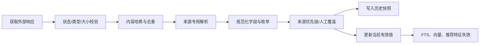
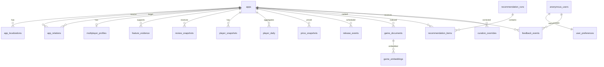

# 数据与存储规格

## 1. 数据原则

- SQLite 保存权威业务状态；FTS、向量和推荐快照都是可重建派生数据。
- 每个外部事实都保留来源、抓取时间、内容哈希和可信度。
- 当前值与历史快照分离，避免每次查询扫描历史表。
- 原始外部文档按必要性和保留期保存，不无限积累原始评论文本。
- 不把“缺失”写成 `false`，不把 AI 推断写成官方事实。
- 客户端缓存数据库与服务端权威数据库完全分离。

## 2. 数据源

| 数据 | 首选来源 | 说明 |
| --- | --- | --- |
| App 目录 | Steam `IStoreService/GetAppList` | 支持 AppID 分页、`last_modified` 和增量过滤，需要 Web API Key |
| 当前玩家数 | Steam `ISteamUserStats/GetNumberOfCurrentPlayers` | 单 AppID 当前在线，不能统计离线 Steam 玩家 |
| 评论摘要 | Steam Store Reviews API | 获取总正/负评价、评分描述和分页评论 |
| Demo 规则 | Steamworks Demo 文档与商店关系数据 | Demo 使用独立 AppID，需要关联本体 |
| 发售状态/日期 | 经批准的 Steam 商店适配器 | 没有一个公开 Web API 完整覆盖日历，必须单独做可行性与合规验证 |
| 多人能力 | Steam 明确字段、开发者说明、人工校正 | 标签只能作为证据，不能独立证明自建服或主导体验 |
| 价格/平台/语言 | 经批准的商店适配器 | 价格按地区和币种保存快照 |
| AI 摘要/特征 | MPGS AI 离线任务 | 派生数据，必须引用输入文档并保存模型版本 |

禁止以抓取 SteamDB 等第三方站点作为 MVP 基础数据源。使用第三方数据前必须取得许可并建立独立适配器，不得把其页面结构写进核心领域逻辑。

## 3. 采集策略

### 3.1 调度建议

| 任务 | 重点候选 | 长尾候选 |
| --- | --- | --- |
| App 目录增量 | 每日 | 同一全局任务 |
| 发售日/状态/Demo | 每 6 小时 | 每日 |
| 评论摘要 | 每 6 小时 | 每日或每 3 日 |
| CCU | 每 30 分钟 | 每 6～24 小时 |
| 价格 | 每 6 小时 | 每日 |
| 服务状态人工复核 | 事件触发 | 每月抽样 |
| AI 文档/Embedding | 内容哈希变化 | 进入重点候选时 |

重点候选包括当前推荐流、即将发售、用户近期检索和人工关注的游戏。

### 3.2 调用预算

Steam Web API 条款当前写明每日最多 `100,000` 次调用。调度器必须把每类请求放入共享令牌桶，并保留安全余量。

示例预算，不是固定配置：

```text
500 个重点 App，每 30 分钟 CCU       24,000/day
3,000 个长尾 App，每 6 小时 CCU      12,000/day
目录、详情、失败重试和保留余量        < 40,000/day
```

商店端点可能有不同或未公开的限流规则，必须使用独立限流器、清晰 User-Agent、缓存、指数退避和低并发。不能把 Web API 的 100,000 次预算理解为商店页面抓取授权。

### 3.3 任务状态

每个采集任务使用：

```text
source + task_type + entity_key + due_at + priority
```

领取任务时写入短租约；提交必须携带 `job_id` 和幂等键。网络请求在数据库事务外执行，写入规范化结果时使用短事务。

## 4. 规范化流程



解析器失败时保留现有当前值并记录结构变化，不把空解析结果覆盖到数据库。

## 5. 标识和通用类型

- Steam AppID：SQLite `INTEGER`，Rust `u32`，API 返回数字；写入时校验 `0..=4294967295`。
- 内部实体 ID：UUIDv7 或单调整数，不能与 AppID 混用。
- 时间：数据库统一使用 UTC Unix 毫秒，字段后缀 `_at_ms`。
- 日期：只有日粒度的发售日期使用 ISO `YYYY-MM-DD` 文本，并保存精度枚举。
- 价格：整数最小货币单位，例如人民币分；同时保存 ISO 4217 币种与商店地区。
- 布尔值：SQLite `INTEGER CHECK(value IN (0,1))`；未知值使用 `NULL` 或显式枚举。
- 比例/分数：`REAL CHECK(value BETWEEN 0 AND 1)`。
- 枚举：MVP 使用受约束 `TEXT`，由应用和 CHECK 共同校验。

## 6. 逻辑数据模型



## 7. 核心表

### 7.1 目录与关系

#### `apps`

| 字段 | 说明 |
| --- | --- |
| `app_id` PK | Steam AppID |
| `app_type` | game, demo, playtest, tool, dlc, unknown |
| `canonical_name` | 当前默认名称 |
| `release_state` | released, upcoming, coming_soon, retired, unknown |
| `release_date` | 精确日期可用时填写 |
| `release_date_precision` | day, month, quarter, year, tba |
| `is_early_access` | 可空布尔 |
| `current_data_confidence` | 当前记录综合可信度 |
| `source_modified_at_ms` | 来源报告的更新时间 |
| `created_at_ms`, `updated_at_ms` | MPGS 时间 |

索引：`release_state, release_date`、`app_type`、`updated_at_ms`。

#### `app_relations`

关系：`demo_of`、`playtest_of`、`dedicated_server_for`、`edition_of`、`replaces`。

唯一键：`source_app_id, target_app_id, relation_type`。保存 `confidence`、`evidence_id` 和 `verified_by_human`。

#### `app_localizations`

唯一键：`app_id, language`。保存本地化名称、短描述和来源，不在 `apps` 中堆积多语言列。

### 7.2 多人特征

#### `multiplayer_profiles`

每个基础游戏一条当前有效画像：

```text
dominant_mode
connection_methods_json
server_dependency
join_methods_json
progression_type
min_players
recommended_min_players
recommended_max_players
hard_max_players
private_session
online_coop
self_hosted_server
drop_in_out
crossplay
service_status
profile_confidence
computed_at_ms
```

集合字段 MVP 可用受校验 JSON 数组；用于高频过滤的字段必须单独成列。

#### `feature_evidence`

```text
evidence_id PK
app_id
feature_name
value_json
source_type
source_ref
source_document_id nullable
confidence
observed_at_ms
expires_at_ms nullable
is_active
```

对 `app_id, feature_name, is_active` 建索引。证据不会因当前值改变而原地覆盖，历史记录保留用于审计。

#### `curation_overrides`

保存人工覆盖值、原因、外部证据、操作者、创建/撤销时间。有效值解析时人工覆盖优先，但撤销后回到当前最佳来源值。

### 7.3 时间序列

#### `review_snapshots`

唯一键：`app_id, region_scope, language_scope, captured_at_ms`。

保存 `total_positive`、`total_negative`、`total_reviews`、Steam score、Wilson 值、是否过滤 off-topic activity 和来源参数哈希。

#### `player_snapshots`

保存单次 CCU。唯一键：`app_id, captured_at_ms`。原始高频记录按保留策略清理。

#### `player_daily`

保存 UTC 日聚合：最小、最大、中位近似、均值、样本数、缺失率。推荐器优先读取该表和近期滚动聚合。

#### `price_snapshots`

唯一键：`app_id, country_code, currency, captured_at_ms`。保存原价、现价、折扣、是否可购买和套餐标识。

#### `release_events`

保存发售日期每次变化，包含旧值、新值、精度、来源和观察时间。当前日期同时物化到 `apps`。

### 7.4 来源与任务

#### `source_documents`

保存清洗文本或短期原始响应：

```text
document_id
source
entity_type
entity_key
content_type
content_hash
content_text_or_blob
fetched_at_ms
expires_at_ms
parse_version
```

含个人评论文本的文档保留期更短；用于长期推荐的应是聚合主题和证据片段，而不是无限保存全文。

#### `source_cursors`

保存分页游标、`if_modified_since`、ETag、上次成功和下次运行时间。

#### `source_runs`

每次采集运行保存状态、请求数、成功数、错误类别、限流消耗和解析器版本。

#### `jobs`

保存任务、优先级、尝试次数、租约持有者、租约到期时间和幂等键。MVP 不引入外部消息队列。

### 7.5 检索与 AI

#### `game_documents`

一个游戏可有多个受控文档块：`identity`、`store_summary`、`multiplayer_profile`、`review_topics`、`curation_notes`。保存内容哈希、语言、可见范围和更新时间。

#### `game_fts`

FTS5 虚拟表，索引标题、别名、标签和可检索文本。使用外部内容表或显式同步任务，避免隐藏触发器逻辑难以排错。

#### `game_embeddings`

```text
document_id
provider
model
dimensions
vector_blob
is_l2_normalized
content_hash
created_at_ms
```

唯一键：`document_id, provider, model, content_hash`。向量以明确端序的 `float32` BLOB 保存；读取时校验字节长度等于 `dimensions * 4`。

#### `ai_analyses`

保存离线特征提取结果和验证状态。原始模型输出与已接受的结构化特征分离，未验证输出不能进入当前多人画像。

#### `ai_analysis_cache`

保存在线/离线请求缓存键、模型、提示词版本、输入哈希、有效输出、用量和过期时间。

### 7.6 用户与推荐

#### `anonymous_users`

服务端生成内部用户 ID，只保存创建时间、最后活动和隐私设置。设备令牌只保存不可逆哈希。

#### `user_preferences`

每用户一条当前偏好，并带 `version` 做乐观并发控制。枚举与数值范围由 API 和数据库共同验证。

#### `feedback_events`

追加式事件表：`like`、`not_interested`、`played`、`too_competitive`、`party_size_mismatch`、`hosting_friction`。撤销使用新事件，不删除历史。

#### `recommendation_runs`

保存请求上下文哈希、算法/配置版本、特征快照、分区、AI 状态和生成时间。

#### `recommendation_items`

保存每个候选的最终名次、基础分、个人分、AI 分、风险、分项 JSON 和证据 ID。高流量后可只保留抽样或聚合，MVP 保留有限周期用于调试。

### 7.7 算法配置

#### `algorithm_configs`

保存不可变版本化 JSON、Schema 版本、创建者、创建时间和状态。只有一个版本可标记为当前生产配置；切换必须写审计事件。

## 8. SQLite 配置

MVP 初始策略：

```sql
PRAGMA foreign_keys = ON;
PRAGMA journal_mode = WAL;
PRAGMA synchronous = FULL;
PRAGMA busy_timeout = 5000;
PRAGMA trusted_schema = OFF;
```

- `journal_mode` 在初始化阶段设置并验证实际返回值。
- `synchronous=FULL` 优先保护用户反馈与人工校正；只有基准和恢复测试证明可接受后才考虑 `NORMAL`。
- 连接池限制读连接数量，写连接由 Storage 层统一协调。
- `busy_timeout` 不能替代短事务和写入调度。
- 定期 checkpoint，并监控 WAL 文件大小；不能在每次请求后强制 checkpoint。

## 9. 迁移

- 迁移文件名称：`NNNN_description.sql`。
- 每个正式版本只能向前迁移，不能在已发布迁移中修改 SQL。
- 服务启动时只有 `migrate` 角色可执行迁移；其他角色检查版本并在不兼容时拒绝 ready。
- 破坏性迁移采用“新增列/表 -> 双写/回填 -> 切读 -> 后续版本清理”。
- 每个迁移在空库、上一版本副本和包含代表性数据的测试库上验证。

## 10. 保留策略

初始值：

| 数据 | 保留期 |
| --- | --- |
| CCU 原始 30 分钟快照 | 90 天 |
| CCU 日聚合 | 长期 |
| 评论/价格快照 | 每日长期；高频记录 180 天后降采样 |
| 原始商店响应 | 30 天，必要证据片段长期 |
| 原始评论文本 | 默认不长期保存，最长 30 天用于聚合 |
| 推荐运行明细 | 90 天或按容量抽样 |
| AI 在线请求缓存 | 7～30 天，取决于是否含用户偏好 |
| 人工校正与审计 | 长期 |

清理任务必须按批次删除并避免长事务。

## 11. 备份与恢复

- 每日一致性全量备份；根据更新量增加更频繁备份。
- 使用 Online Backup API 或停止写入后的受控快照，不复制活动中的主文件/WAL 组合。
- 备份加密与访问控制由部署层处理，密钥不与备份放在一起。
- 保留多代备份，并定期在独立临时目录执行恢复演练。
- 恢复验收：`integrity_check`、迁移版本、关键表行数、黄金 AppID、FTS 重建和推荐冒烟测试。
- Embedding、FTS 和推荐快照可在恢复后重建，不应阻塞权威数据恢复。

## 12. 客户端缓存数据库

客户端 SQLite 只保存：

- 推荐流和详情响应缓存。
- 偏好副本与服务端版本号。
- 待同步反馈及幂等键。
- 图片缓存索引，不一定保存图片本身。

服务端 Schema 与客户端 Schema 不共享迁移文件。客户端缓存可在不影响用户偏好和待同步反馈的前提下重建。

## 13. 数据质量检查

定时检查：

- Demo/Playtest 关系循环或指向非基础游戏。
- `recommended_min > recommended_max` 等人数错误。
- 已发售游戏仍为未来日期，或日期精度与值冲突。
- 评论总数回退、CCU 长期缺样、价格币种不一致。
- 当前有效值没有任何活动证据。
- AI 特征引用不存在或已过期的文档。
- 人工覆盖与官方新数据冲突，需要复核而不是自动覆盖。

检查结果进入内部审核队列，并计入数据健康指标。

