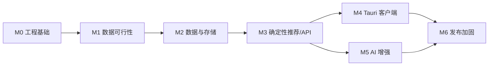

# MVP 开发计划

## 1. 交付策略

按可运行垂直切片推进，每个里程碑都必须具备测试和可观察结果。顺序优先验证最大风险：Steam 数据可行性与熟人联机特征质量，然后才扩大客户端和 AI 功能。

不以预估日期作为完成标准；以本文件的退出条件为准。

## 2. 里程碑

### M0：工程基础

交付：

- Rust workspace、领域类型、推荐器纯函数和 Axum 进程骨架。
- 配置、错误、日志、版本和健康检查约定。
- 文档基线和需求追踪表。
- 本地 `fmt/test/clippy` 可重复通过。

退出条件：

- `cargo test --workspace` 通过。
- 推荐器不依赖数据库、HTTP 或 AI SDK。
- 服务端能返回 `/health/live` 和 `/v1/meta`。

### M1：数据可行性 Spike

目标是验证数据，不追求完整产品代码。

交付：

- `GetAppList` 增量目录原型。
- 评论摘要和当前玩家数采集原型。
- 即将发售、Demo/Playtest 关系和商店详情适配器可行性报告。
- 50 个黄金游戏的人工特征表和证据。
- 实测限流、失败类型、响应大小与数据缺失报告。

退出条件：

- 能稳定获取并规范化至少 2,000 个多人候选。
- 能为黄金集建立 AppID、发售状态、评价和至少基本多人特征。
- 明确哪些字段来自官方稳定接口，哪些需要经批准的易变适配器或人工维护。
- 若日历/Demo 数据无法合规稳定获取，产品范围必须在继续开发前调整。

实现状态（2026-07-14）：

- 代码：`crates/steam-source`（`mpgs-steam-source`），夹具测试覆盖 DAT-001～004。
- 报告：[M1_FEASIBILITY.md](M1_FEASIBILITY.md)。
- 黄金集：`crates/steam-source/fixtures/golden_set_v0.json`（50 条，`golden-0.1.0`）。
- 2,000 候选：M1 完成官方目录分页/增量/续传与 Proposal；M3 后续增加易变商店搜索适配器，并于 2026-07-14 低频采集 2,071 条真实多人分类候选。分类证据不替代深度画像。
- 产品范围：**不缩减**四分区；日历/Demo 走易变适配器 + 人工回退。

### M2：数据与存储

交付：

- SQLite 迁移、Repository trait 和连接策略。
- 目录、关系、多人画像、证据、评论、CCU、价格、来源任务表。
- 调度、限流、重试、幂等和数据质量检查。
- 内部人工校正 API 的最小实现。
- 备份、恢复和完整性验证脚本。

退出条件：

- 空库和上一版本库迁移测试通过。
- 连续 7 天重点候选采集可运行，或使用时间加速的等价集成验证。
- 人工覆盖不会被后续采集覆盖。
- 活动数据库的受控备份可在新目录恢复并通过检查。

实现状态（2026-07-14）：

- 代码：`crates/storage`（`mpgs-storage`）、`migrations/0001_initial.sql`、`migrations/0002_data_quality_findings.sql`。
- CLI：`apps/dbtool` + `scripts/backup_db.ps1` / `scripts/restore_db.ps1`。
- API：`/health/ready`、`/admin/v1/games/{app_id}/overrides`、`/admin/v1/overrides/{id}/revoke`、`/internal/v1/jobs/*`（需 `MPGS_DATABASE_PATH` + `MPGS_ADMIN_TOKEN`）。
- 测试覆盖：空库/上一版本迁移、幂等迁移、人工覆盖不被采集覆盖、jobs 租约/重试/幂等完成、7 天×30 分钟加速 CCU 采集、备份恢复完整性。

### M3：确定性推荐与公开 API

交付：

- 四分区候选生成、评分、个性化和 MMR。
- 黄金集、分项解释和算法配置版本。
- 偏好、推荐流、日历、搜索、详情、证据和反馈 API。
- OpenAPI 与契约测试。
- 服务端缓存、ETag、游标和幂等写入。

退出条件：

- PRD 中默认排序断言通过。
- 四个分区在数据允许时均能返回有效候选。
- 不登录可完成偏好、浏览、搜索、详情和反馈。
- 普通缓存 API 达到 P95 目标。

评审状态（2026-07-14）：

- 推荐：`rank_feed` + 个性化 + MMR + 解释；PRD 默认排序单测通过。
- 迁移：`0003_users_feedback_algorithm.sql`、`0004_m3_integrity_fixes.sql`、`0005_m3_recommendation_inputs.sql`；持久化空库不再自动写入演示数据，只有内存模式或 `MPGS_SEED_DEMO=true` 才启用演示目录。
- API：原 M3 公开接口加 `POST /v1/session/refresh`；访问/刷新令牌随机生成、持久化过期并轮换。
- 推荐：滚动 180 天分区、Wilson/活跃度门槛、反馈闭环、有界 MMR 窗口；四分区演示契约测试均通过。
- 横切：请求 ID 同时进入响应头和错误体；ETag 可在查询/评分前短路；游标绑定数据快照与完整偏好/反馈上下文；反馈完整载荷幂等。
- 契约与安全：`/openapi.json` 从处理器和 Rust Schema 生成并有路径/字段契约测试；普通读取、搜索、会话和反馈按设备/会话与 IP 双键限流，叠加全局上限。
- 配置与偏好：活动 `algorithm_configs.config_json` 驱动分区天数、质量/活跃/熟人门槛、候选上限和 MMR；平台、语言、预算、时长和 Demo 条件进入确定性硬过滤，未知数据保持可候选。
- SQLite：文件库读请求使用独立只读连接，写请求保持单写锁；所有 API 数据库调用在 Tokio 阻塞线程池执行，并有运行时不阻塞及读写句柄并发测试。
- 性能：2,000 游戏本地调试构建手工门槛测试，未缓存 P95 `36.04 ms`、ETag 命中 P95 `0.92 ms`，低于 NFR-001 的 `500 ms`；已覆盖数据库锁等待不阻塞 Tokio 和文件库并发只读回归，尚未完成生产硬件压测。
- 数据门禁：2026-07-14 使用 `collect-steam-candidates` 得到 2,071 条真实多人分类候选，`mpgs-dbtool m3-audit` 通过；同时 `recommendation_ready_profiles=0`，后续数据富化不得省略。
- 跨平台构建：2026-07-14 的 [GitHub Actions 构建](https://github.com/Lotulune/mpgs/actions/workflows/ci.yml) 已通过质量门禁及 Windows/Linux x64/ARM64 四个原生构建，并生成 `mpgs-windows-x64`、`mpgs-windows-arm64`、`mpgs-linux-x64`、`mpgs-linux-arm64` 制品。
- **M4 可以开始**：M3 工程、目录和跨平台构建门禁均已满足。真实候选当前仍缺平台、评价、CCU 和深度多人能力画像；数据富化应与 M4 并行，且必须在发布前通过推荐数据质量门禁。

### M4：Tauri 桌面客户端

交付：

- Tauri 2 + React/TypeScript 应用。
- 首次偏好、四分区、日历、搜索、详情、反馈和设置界面。
- 客户端 SQLite 缓存、ETag 和待同步反馈。
- 加载、空结果、数据过期、离线和服务错误状态。
- Windows x86_64 主目标与 Linux/macOS 冒烟构建。

退出条件：

- PRD 三个核心用户流程端到端通过。
- 断网后能浏览最后一次成功快照，且显示离线/数据时间。
- 界面在目标桌面尺寸下无溢出和关键控件遮挡。
- Tauri 权限最小化，客户端包中没有服务端 Key。

实现状态（2026-07-15）：

- 首个垂直切片（主题优先）：`web/`（Vite + React + TS，pnpm workspace）+ `apps/desktop/src-tauri/`（Tauri 2 壳，独立 Cargo workspace，不入根 workspace）。
- 界面：首次主题选择 + 偏好引导、四分区推荐流（原因/风险/分数/人数、游标加载更多）、游戏详情（联机画像/可用性/评价/证据/Steam 跳转）、反馈闭环（乐观 UI + 离线队列 + 撤销）。加载/空/错误/过期/离线态按主题定制。
- 五主题：复古电子、极简白线、MC 方块、Steam 商店、樱枫和风；各带独立设计 token 皮肤与特效模块（环境动画 + 点击反馈 + `like/dismiss/confirm/error` 语义动作）。单 rAF 有界粒子池，隐藏暂停，尊重 `prefers-reduced-motion`，可切全/低/关；贴图运行时程序化生成，无第三方素材。
- 客户端缓存：类型化 API 客户端含匿名会话自举与 401 刷新、`x-device-id`、ETag `If-None-Match` 快照缓存（离线浏览）、与缓存分离的离线反馈队列（幂等键 + 撤销 + 重放）。Tauri 使用应用私有目录中的 SQLite 持久化客户端状态，并迁移旧构建的 `localStorage` 数据；纯浏览器开发环境继续使用 `localStorage`。
- 搜索/日历/设置（第二批切片，2026-07-15）：防抖名称搜索（`GET /v1/search`）；发售日历（`GET /v1/calendar`，按月分组 + 日期未定分区 + Demo 过滤）；设置（偏好编辑含乐观版本处理与 `version_conflict` 重试、主题/特效强度、清缓存保留未同步反馈、同步状态）。外壳导航扩展为四分区 + 搜索/日历/设置 + 详情返回来源列表。
- 服务端：新增 CORS 白名单层（零新依赖手写中间件，默认覆盖 Tauri webview 源，预检短路），含 preflight/echo/拒绝三项测试。
- 前端测试（vitest）：粒子池边界、五主题特效完整性、API 会话刷新/ETag/离线回退/清缓存、反馈队列离线重放与撤销、格式化未知值、日历分组、偏好变更检测、防抖。
- 验收门禁（2026-07-16 加固）：[`scripts/m4_acceptance.ps1`](../scripts/m4_acceptance.ps1) + [`docs/M4_ACCEPTANCE.md`](M4_ACCEPTANCE.md) 严格检查每条推荐理由、反馈与撤销、非空搜索、日历早期数据字段、ETag `304`、指定离线契约测试和构建；失败也生成带 Git/版本/SHA-256 的最新报告。旧版 `21/21` 结果作废。
- 跨平台门禁：CI Web test/build + Linux DEB / Windows NSIS / macOS APP 的 Tauri 原生构建矩阵。**2026-07-16 commit `5e0274b` 全绿**，证据 [`M4_CI_RUN.md`](M4_CI_RUN.md)（run [29497583493](https://github.com/Lotulune/mpgs/actions/runs/29497583493)）。
- 原生 E2E：Windows/Linux `tauri-driver` 覆盖 SQLite 跨进程重启、PRD 7.1/7.2/7.3、反馈刷新、真实断服务离线快照和 1024×640 / 1280×800 截图。Windows 本机 `7/7` 见 [`M4_DESKTOP_E2E_RUN.md`](M4_DESKTOP_E2E_RUN.md)；CI 上 Linux/Windows E2E 均 success。macOS 以 APP bundle 构建冒烟为证据（无桌面 WebDriver）。
- **M4 正式关闭（2026-07-16）**：四层证据齐备——API 严格验收、客户端测试/构建、三平台 bundle smoke、Win/Linux 原生 E2E；另含 Windows 安装器安装后启动 [`M4_INSTALLER_LAUNCH_RUN.md`](M4_INSTALLER_LAUNCH_RUN.md)。目标尺寸截图、最小权限和无服务端 Key 复核已通过。发布前数据富化与签名等仍属后续门禁，不回退 M4 退出条件。
- 真实候选自动富化（2026-07-16 本地审计）：`m3-real.db` 候选 2091、平台/评价/CCU 2091、语言 2090、有效价格 2081；ready 画像 50、trusted 画像 14（黄金集）。历史 `US/USD` 快照需继续刷新为默认 `CN/schinese` 区域数据；深度联机画像扩量与典型局时长仍为发布门禁。

后续阶段功能——游玩意愿投票（2026-07-15 已实现）：

- 目标：社区级「想玩」投票，越多人投该游戏排序越靠前（区别于个人反馈的 `like`，这是跨用户的全局人气信号）。
- 服务端：迁移 `0006_play_intent_votes`（每 `(app, user)` 一票可切换）；`POST /v1/games/{app_id}/play-intent`（Bearer + 反馈桶限流）；票数与 `voted` 进入 feed 条目与详情；投票纪元进入 feed/详情 `ETag`。
- 排序：`play_intent_count` 进入 `RankingInput`，按 `count/(count+saturation)` 饱和归一、`play_intent_weight` 有界加成（0 票零影响，不覆盖硬过滤）；参数入 `RecommendationConfig`（`rules-0.2.0` 种子启用；旧 `rules-0.1.0` 配置缺字段自动降级为禁用，行为不变）。
- 客户端：`PlayIntentStore`（乐观切换 + 离线待同步 + 重连重放 + 永久失败回退），卡片与详情的「▲ 想玩 N」按钮（含主题化 like/dismiss 特效）；详情请求携带令牌以取回 `voted`。
- 测试：storage 切换/聚合/404 单测；recommender 票数提升排序且 0 票惰性；server 401/切换+feed 反映/404 集成测试；前端 store 乐观/离线重放/永久失败回退（vitest）。

### M5：AI 与语义检索

交付：

- Provider 抽象、Disabled Provider 和一个真实 Provider 适配器。
- FTS5 文档、Embedding 生成与 Rust 向量检索。
- 自然语言意图解析、Top 20 AI 分析和结构化验证。
- 缓存、预算、限流、超时、熔断和确定性回退。
- 提示注入、无效 AppID、证据和输出边界测试。

退出条件：

- AI 关闭、超时或无 Key 时不影响普通推荐。
- 所有对用户展示的具体 AI 事实都有证据。
- 候选外 AppID、无效分数和伪造证据无法穿过服务端验证。
- 在线 AI 在总超时内成功或回退。

实现状态（2026-07-16 起步切片）：

- 新增 `crates/ai`：`AiProvider` / `EmbeddingProvider`、`DisabledProvider`、`FakeProvider`、OpenAI-compatible HTTP 适配器、超时/预算/熔断 `AiGateway`、非可信文本包装、排序输出校验（候选外 AppID / 分数范围 / 伪造 evidence 拒绝）、float32 向量编解码、余弦相似度与 RRF。
- 迁移 `0007_m5_ai_retrieval`：`game_documents`、`game_fts`、`game_embeddings`、`ai_analyses`、`ai_analysis_cache`；`storage::retrieval` 支持文档/FTS/向量/缓存读写。
- 服务端：`MPGS_AI_PROVIDER=disabled|openai_compat`（及 Key/Base URL/Model/Timeout）；`/v1/meta.ai_available` 反映网关；自然语言推荐内部固定做 Top 20 AI 分析、再截断到公开 limit，并返回 `ai_status=used|cached|fallback`，失败时确定性结果仍可用。
- 测试：`mpgs-ai` 单元测试、FTS/embedding/cache 存储测试、NL fallback 与 Fake AI `used` 集成测试。
- 检索同步：`sync_retrieval_from_catalog` + `hybrid_search`（FTS/向量/RRF）+ `mpgs-dbtool sync-retrieval`。
- Embedding：`OpenAiCompatEmbeddingProvider` + `embedding_provider_from_env`（`MPGS_AI_EMBED_PROVIDER=hash|openai_compat|disabled`）；默认本地 hash。
- 离线特征：`extract_offline_features` 将画像物化为带 evidence 的 `ai_analyses`（高影响未知项进入 unknowns）；`mpgs-dbtool extract-offline-features`。
- NL：AI 结果写入 `ai_analysis_cache`，重复请求返回 `ai_status=cached`；UI 展示 used/cached/fallback/disabled 与 `ai_summary`。
- Embedding 批任务：`mpgs-dbtool embed-documents` 按 `MPGS_AI_EMBED_PROVIDER` 对缺失 content_hash 的文档批量回写 `game_embeddings`（hash 默认可用；openai_compat 需 Key）。
- 验收：[`docs/M5_ACCEPTANCE.md`](M5_ACCEPTANCE.md) + [`scripts/m5_acceptance.ps1`](../scripts/m5_acceptance.ps1) 覆盖离线退出条件；生产 Key 实时联调可选。
- **M5 待重新验收（2026-07-17 审查修复）**：已修复用户可见 evidence 约束、AppID 溢出、Provider URL/响应边界、Embedding 查询接线与 Hash 一致性、历史向量/文档失效、Top 20、缓存隔离和验收空跑问题。须在干净提交上重新运行 [`scripts/m5_acceptance.ps1`](../scripts/m5_acceptance.ps1) 并更新 [`M5_ACCEPTANCE_RUN.md`](M5_ACCEPTANCE_RUN.md) 后关闭。

### M6：发布加固

交付：

- 性能、长时间运行、故障注入、备份恢复和升级测试。
- Windows/Linux 服务包；Windows/Linux/macOS 客户端包。
- 签名、自动更新、隐私政策、第三方许可和 Steam 品牌使用审查。
- 运维手册、回滚说明和已知限制。

退出条件：

- [PRD 发布验收](PRD.md#13-mvp-发布验收) 全部通过。
- 构建产物与版本、算法配置和数据库迁移可追溯。
- 发布负责人完成隐私、许可与数据源合规签字。

## 3. 可执行 Backlog

### 3.1 Foundation

| ID | 任务 | 依赖 | 验收 |
| --- | --- | --- | --- |
| FND-001 | 建立领域类型与序列化约定 | 无 | AppID、分区、多人特征有边界测试 |
| FND-002 | 实现推荐纯函数与默认配置 | FND-001 | 黄金信号单元测试通过 |
| FND-003 | 建立 Axum 组合根和健康接口 | FND-001 | 进程启动、优雅退出、健康响应测试 |
| FND-004 | 建立统一错误与 request_id | FND-003 | 日志和错误响应可关联 |
| FND-005 | 建立配置分层和密钥脱敏 | FND-003 | 启动日志不泄漏配置值 |

### 3.2 Data

| ID | 任务 | 依赖 | 验收 |
| --- | --- | --- | --- |
| DAT-001 | Steam App 目录 Spike | FND-003 | 分页、增量和断点续传样例 |
| DAT-002 | 评论摘要 Spike | DAT-001 | 正/负/总数和参数哈希规范化 |
| DAT-003 | CCU Spike | DAT-001 | 采样、缺失和离线玩家限制记录 |
| DAT-004 | 日历/Demo 适配器评审 | DAT-001 | 来源、稳定性、合规和回退结论 |
| DAT-005 | 黄金集与人工证据 | DAT-001 | 至少 50 个游戏、双人复核高影响字段 |
| DAT-006 | SQLite 初始迁移 | DAT-001~005 | Schema、索引、约束和迁移测试 |
| DAT-007 | Source Adapter 和任务调度 | DAT-006 | 限流、重试、租约、幂等测试 |
| DAT-008 | 人工校正与审计 | DAT-006 | 创建、撤销和来源恢复测试 |
| DAT-009 | 备份/恢复 | DAT-006 | 自动恢复和完整性检查 |

### 3.3 Recommendation and API

| ID | 任务 | 依赖 | 验收 |
| --- | --- | --- | --- |
| REC-001 | 特征有效值与置信度计算 | DAT-006, DAT-008 | 来源优先级和未知值测试 |
| REC-002 | Wilson、活跃度和趋势聚合 | DAT-006 | 小样本、缺样和事件尖峰测试 |
| REC-003 | 四分区候选和评分 | REC-001, REC-002 | 门槛和分区黄金测试 |
| REC-004 | 偏好重排与反馈 | REC-003 | 人数/竞技/自建服方向测试 |
| REC-005 | MMR 与探索位 | REC-004 | 重复率、多样性和低置信标识测试 |
| API-001 | 会话与偏好 API | FND-004, DAT-006 | 令牌、版本冲突和范围测试 |
| API-002 | 推荐/日历/详情 API | REC-003, API-001 | OpenAPI、ETag、游标测试 |
| API-003 | 搜索/证据/反馈 API | REC-004, API-001 | FTS、幂等和权限测试 |
| API-004 | 管理调试 API | DAT-008, REC-003 | 审计和角色隔离测试 |

### 3.4 Desktop

| ID | 任务 | 依赖 | 验收 |
| --- | --- | --- | --- |
| UI-001 | Tauri/React 应用壳与设计 token | API-001 | Windows 启动与权限审查 |
| UI-002 | 首次偏好与设置 | UI-001, API-001 | 首次/重进/版本冲突流程 |
| UI-003 | 推荐流与日历 | UI-001, API-002 | 四分区、空态、过期态 |
| UI-004 | 搜索与详情 | UI-001, API-003 | 过滤、证据、Steam 跳转 |
| UI-005 | 客户端缓存与离线 | UI-002~004 | 冷启动、断网、反馈重试 |
| UI-006 | 跨平台打包冒烟 | UI-005 | 目标矩阵结果与已知限制 |

### 3.5 AI

| ID | 任务 | 依赖 | 验收 |
| --- | --- | --- | --- |
| AI-001 | Provider 与结构化输出抽象 | FND-004 | Fake/Disabled Provider 测试 |
| AI-002 | 游戏检索文档和 FTS5 | DAT-006 | 增量失效与语言测试 |
| AI-003 | Embedding 与 Rust 向量扫描 | AI-002 | 维度、哈希和召回基准 |
| AI-004 | 意图解析和白名单工具 | API-003, AI-001 | Schema、边界和注入测试 |
| AI-005 | Top 20 二次分析 | REC-005, AI-004 | AppID/证据/分数验证 |
| AI-006 | 缓存、预算、熔断和回退 | AI-005 | 超时、429、5xx、坏 JSON 测试 |
| UI-007 | AI 推荐交互 | UI-004, AI-006 | used/cached/fallback/disabled 状态 |

## 4. 第一条垂直切片

第一条可演示切片只使用固定夹具数据，目标不是假装完成采集：

1. `domain` 表达分区和多人信号。
2. `recommender` 对 6 个代表游戏信号排序。
3. Server 返回 `/v1/meta` 和一个夹具推荐端点。
4. Tauri 客户端显示一个分区和推荐理由。
5. 自动测试证明默认偏好下合作/自建服信号高于匹配核心信号。

夹具端点必须仅在开发配置启用，不能进入正式数据路径。

## 5. 测试矩阵

| 层 | 测试 |
| --- | --- |
| Domain | 枚举兼容、范围、序列化快照 |
| Recommender | 公式、缺失值、阈值、黄金集、属性测试 |
| Storage | 迁移、约束、事务、并发、恢复 |
| Source | 录制夹具、限流、分页、结构变化、重试 |
| API | OpenAPI、鉴权、游标、ETag、幂等、错误 |
| AI | Fake Provider、Schema、注入、候选约束、回退 |
| Desktop | 组件、键盘导航、响应布局、离线、端到端 |
| Packaging | OS/架构启动、签名、升级、卸载 |

外部接口测试使用录制并脱敏的夹具；默认测试套件不依赖实时 Steam 或付费 AI。

## 6. Definition of Done

每个任务完成必须满足：

- 需求/设计引用清楚，边界和错误场景已实现。
- 单元或集成测试覆盖主要成功与失败路径。
- `fmt`、`clippy -D warnings` 和 workspace tests 通过。
- 公共行为更新 OpenAPI或对应文档。
- 日志不含 Key、令牌、私人原文或完整 AI Prompt。
- 新配置有默认值、范围校验和启动失败说明。
- 数据迁移有升级测试；不可逆影响在发布说明中标记。
- 不留下无负责人、无原因的 TODO。

## 7. 风险清单

| 风险 | 影响 | 处理 |
| --- | --- | --- |
| 日历/商店详情接口易变 | 新游核心能力失效 | M1 最先 Spike；适配器隔离、快照和人工回退 |
| 自建服特征缺失 | 排序偏离产品目标 | 人工证据和低置信 AI 提取并行 |
| Steam 配额或封禁 | 数据过期 | 分层采样、共享预算、缓存、退避和合规审查 |
| SQLite 写竞争 | 前台延迟 | 单写队列、短事务、后台批处理和迁移阈值 |
| AI 幻觉/注入 | 错误推荐或安全问题 | 候选白名单、证据校验、受限权重和回退 |
| AI 成本失控 | 无法持续运营 | 非默认调用、Top 20、缓存、设备/全局预算 |
| 跨平台打包差异 | 发布延期 | 早期冒烟；macOS 原生 runner；Linux 依赖基线 |
| 素材与 Steam 品牌许可 | 发布风险 | 上线前法律/品牌审查，不抓取第三方素材库 |

## 8. 需要后续明确授权的工作

以下不在当前准备工作中执行：

- 发布、签名或部署 CI/CD（仅构建/测试的 GitHub Actions 已于 2026-07-14 获确认）。
- 购买域名、云资源、证书、Apple/Windows 签名服务。
- 注册 Steam Web API Key 或 AI Provider Key。
- 部署公网服务或上传发布物。
- 建立生产数据库或导入真实用户数据。

在对应里程碑开始前，需要由项目负责人确认供应商、成本和发布主体。
